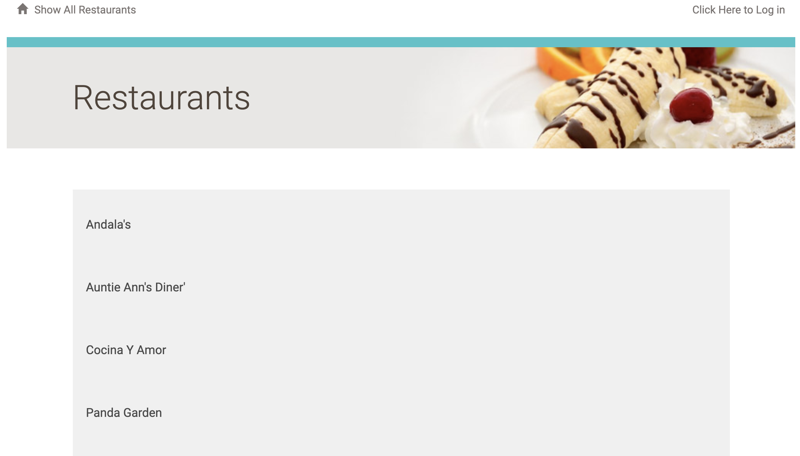
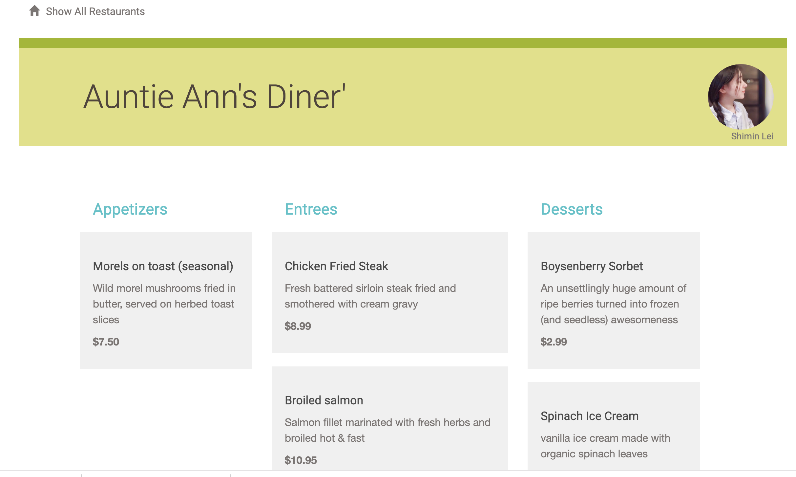
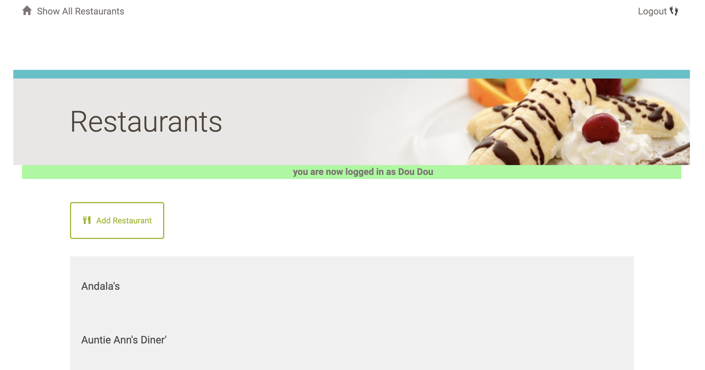
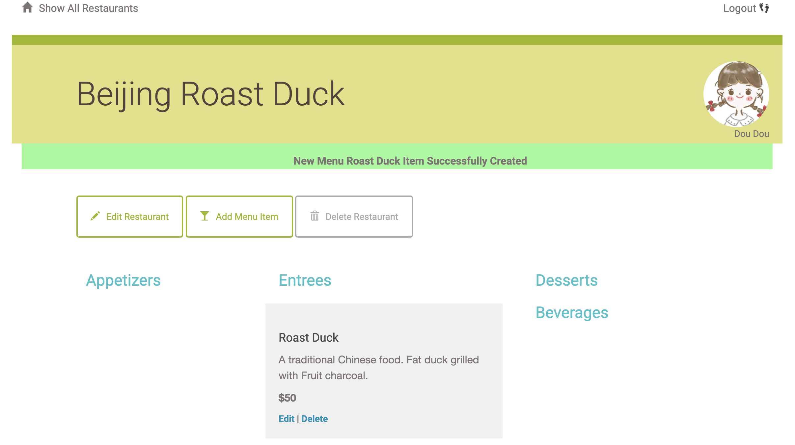
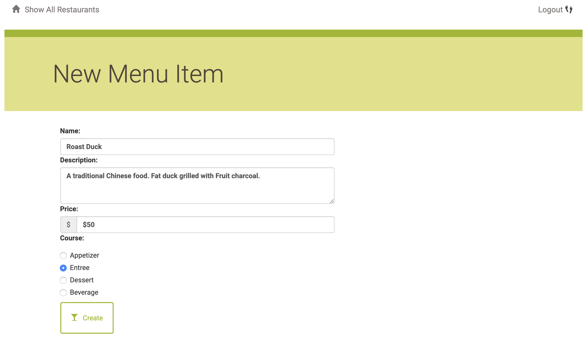

# Description

This is a project made for a Restaurant Menu Website.

# Web Presentation

- The main page shows all the restaurants.



- You can click into a restaurant and browse the menus and information. 



- You can login with google account and add your own restaurant.



- Create new restaurant.


- You can edit your own restaurant. 

  You can't change other people's restaurant information.



- Add menus and information including name, description, price and course.




# Requirements

1. Virtual machine - [Vagrant](https://www.vagrantup.com/)
2. [VirtualBox](https://www.virtualbox.org/)
3. [SQLAlchemy](https://www.sqlalchemy.org/) module
4. Flask module
5. Python3 

# Setup

1. Fork the [Virtual machine](https://github.com/udacity/fullstack-nanodegree-vm) and setup.

2. `sudo pip install -r requirements.txt`

3. `vagrant up`  to start up the virtual machine.

4. `vagrant ssh` to log into the virtual machine.

5. `cd /vagrant`, copy the project into the directory.

6. Prepare the data according to [Data](#data).

7. `python main.py` to run the Flask web server. In your browser visit **http://localhost:5000** to view the restaurant menu app.  You should be able to view, add, edit, and delete menu items and restaurants.

# <span id="data">Data</span>

   1. `python database_setup.py` to initialize the database.
   2. `python lotsofitems.py` to  populate the database with restaurants and menu items.

# <span id="view">API</span>

See the JSON of all the restaurant:

```url
http://localhost:5000/restaurant/JSON
```


See the JSON of certain restaurant:

```url
http://localhost:5000/restaurant/<int:restaurant_id>/menu/JSON
eg. http://localhost:5000/restaurant/1/menu/JSON
```
See the JSON of certain menu of certain restaurant:

```url
http://localhost:5000/restaurant/<int:restaurant_id>/menu/<int:menu_id>/JSON
eg. http://localhost:5000/restaurant/1/menu/2/JSON
```


